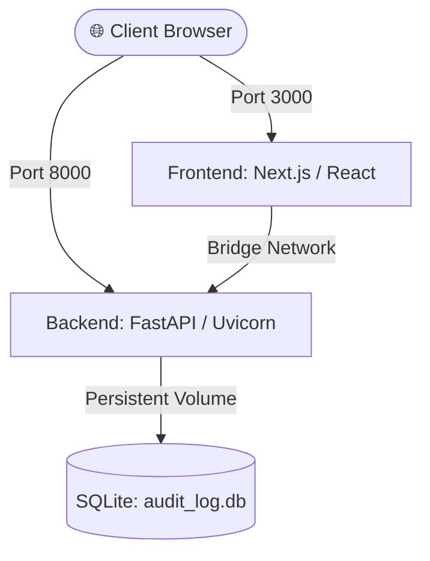

# ⚡ Razorpay Audit Engine — Full-Stack GST Reconciliation Platform

[](https://www.docker.com/)
[](https://fastapi.tiangolo.com/)
[](https://www.python.org/)
[](https://nextjs.org/)
[](https://nodejs.org/)
[](https://www.sqlite.org/)

An enterprise-grade, high-throughput GST Reconciliation & Audit platform designed for matching GSTR-2B purchase registers against ERP sales ledgers with sub-millisecond determinism, anomaly detection, and real-time reconciliation analytics.

---

## 🐳 Docker Deployment Guide

The platform is fully containerized using multi-stage builds, non-root security principles, volume persistence for SQLite audit logs, and integrated container health checks.



---

### 🌐 Service Architecture & Port Mappings

| Service | Port (Host:Container) | Base Image | Purpose | Health Check Endpoint |
| :--- | :--- | :--- | :--- | :--- |
| **`frontend`** | `3000:3000` | `node:20-alpine` | UI Dashboard & Visualization | `GET http://localhost:3000/` |
| **`backend`** | `8000:8000` | `python:3.11-slim` | Reconciliation Engine & APIs | `GET http://localhost:8000/health` |
| **`sqlite_data`** | *Volume* | *Local Driver* | Persistent storage for Audit Trails | Mounted at `/app/data` |

---

### 🚀 Quick Start Commands

#### 1. Clone & Initialize Environment
```bash
# Clone the repository
git clone https://github.com/your-org/razorpay-audit-engine.git
cd razorpay-audit-engine

# (Optional) Customize environment variables
cp .env.example .env
```

#### 2. Build & Launch Containers
Run all services in detached mode with automatic build caching and parallel layer execution:
```bash
docker compose up --build -d
```

#### 3. Monitor Service Health & Logs
Verify that backend health checks pass before frontend requests traffic:
```bash
# Check running container statuses and health state
docker compose ps

# Follow real-time streaming logs
docker compose logs -f

# Follow specific service logs
docker compose logs -f backend
docker compose logs -f frontend
```

#### 4. Access the Application
- **Frontend Dashboard**: [http://localhost:3000](http://localhost:3000)
- **FastAPI Interactive Docs (Swagger)**: [http://localhost:8000/docs](http://localhost:8000/docs)
- **FastAPI ReDoc**: [http://localhost:8000/redoc](http://localhost:8000/redoc)
- **API Health Check**: [http://localhost:8000/health](http://localhost:8000/health)

#### 5. Stop and Teardown
```bash
# Stop containers without losing SQLite database data
docker compose down

# Stop containers and remove persistent volumes (full reset)
docker compose down -v
```

---

### ⚙️ Environment Variables Reference

| Variable | Service | Default Value | Description |
| :--- | :--- | :--- | :--- |
| `PORT` | `backend` | `8000` | Port on which FastAPI ASGI server listens |
| `DATABASE_PATH` | `backend` | `/app/data/audit_log.db` | Absolute path to persistent SQLite database |
| `CORS_ORIGINS` | `backend` | `http://localhost:3000` | Allowed origins for cross-origin requests |
| `NEXT_PUBLIC_API_BASE_URL` | `frontend` | `http://localhost:8000` | Client-accessible API gateway endpoint |
| `BACKEND_INTERNAL_URL` | `frontend` | `http://backend:8000` | Internal docker bridge URL for SSR |

---

### 🛡️ Production & Security Highlights

- **Multi-Stage Optimization**: Both Dockerfiles utilize intermediate builder stages to omit build toolchains (compilers, npm cache, pip cache) from the final runtime image.
- **Non-Root Execution**: Runs under unprivileged users (`appuser:10001` and `nextjs:1001`) preventing container breakouts.
- **Ordered Startup via Healthchecks**: Frontend waits for backend `/health` endpoint to return `200 OK` before accepting connections.
- **Zero-Downtime Data Persistence**: Dedicated named volume `sqlite_data` safeguards transaction audit logs across container lifecycles.
- **Strict `.dockerignore`**: Excludes `node_modules`, `.venv`, `.env`, and local `.db` files from build contexts to ensure airtight CI/CD pipelines.
